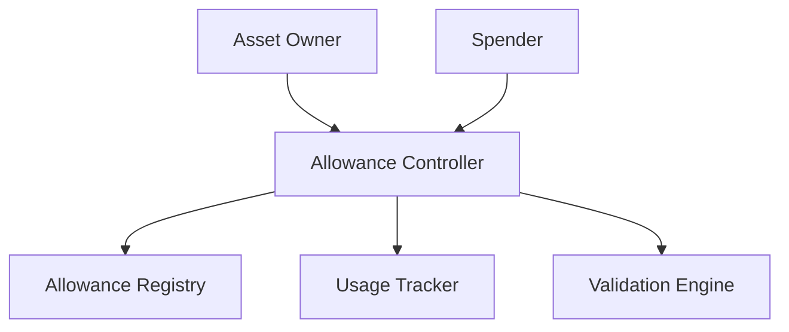

# Authorize Allowance

A flexible and secure smart contract system for dynamic digital asset authorization on the Stacks blockchain.

## Overview

Authorize Allowance provides a robust, fine-grained permission management system for digital assets. By implementing a comprehensive allowance framework, this contract enables precise control over asset interactions, supporting complex authorization scenarios with time-bound and conditional access management.

### Key Features

- Granular access control for multiple asset interaction types
- Time-limited and revocable allowances
- Support for diverse interaction modes (transfer, mint, burn, approve)
- Flexible permission management
- Comprehensive usage tracking
- Secure and auditable allowance mechanisms

## Architecture

The Authorize Allowance system is centered around a core smart contract that manages:
- Allowance creation and modification
- Precise permission control
- Usage tracking and validation
- Expiration management



## Contract Documentation

### Allowance Controller Contract

The main contract (`allowance-controller.clar`) handles all core authorization functionality.

#### Allowance Types Supported
- Transfer Allowance
- Mint Allowance
- Burn Allowance
- Approve Allowance

#### Key Components

1. **Allowance Management**
   - Grant new allowances
   - Modify existing allowances
   - Revoke allowances
   
2. **Authorization Control**
   - Precise permission scoping
   - Time-bound access
   - Usage tracking

3. **Security Mechanisms**
   - Validation of allowance types
   - Expiry enforcement
   - Amount restriction

## Getting Started

### Prerequisites
- Clarinet
- Stacks wallet
- Access to the Stacks blockchain

### Basic Usage

1. **Grant Transfer Allowance**
```clarity
(contract-call? .allowance-controller grant-allowance 
    'SP2JXKH6B14RMT7PP51439ZPWZQYNB3HB5J2289WB 
    "transfer" 
    u1000 
    (some u500))
```

2. **Modify Allowance**
```clarity
(contract-call? .allowance-controller modify-allowance 
    'SP2JXKH6B14RMT7PP51439ZPWZQYNB3HB5J2289WB 
    "transfer" 
    u500 
    (some u1000))
```

3. **Consume Allowance**
```clarity
(contract-call? .allowance-controller consume-allowance 
    'SP3XD84X3PEMTH4PSG0NDAN7BQSZ0B0N1NEAR0ZP2 
    "transfer" 
    u250)
```

## Function Reference

### Public Functions

#### Allowance Management
```clarity
(define-public (grant-allowance 
    (spender principal) 
    (allowance-type (string-ascii 64)) 
    (amount uint)
    (expiry (optional uint))))
(define-public (modify-allowance 
    (spender principal) 
    (allowance-type (string-ascii 64)) 
    (new-amount uint)
    (expiry (optional uint))))
(define-public (revoke-allowance 
    (spender principal) 
    (allowance-type (string-ascii 64))))
```

#### Allowance Interaction
```clarity
(define-public (consume-allowance 
    (owner principal) 
    (allowance-type (string-ascii 64)) 
    (amount uint)))
```

### Read-Only Functions
```clarity
(define-read-only (get-allowance 
    (owner principal) 
    (spender principal) 
    (allowance-type (string-ascii 64))))
```

## Development

### Testing
1. Clone the repository
2. Install Clarinet
3. Run tests:
```bash
clarinet test
```

### Local Development
1. Start Clarinet console:
```bash
clarinet console
```
2. Deploy contracts:
```clarity
(contract-call? .allowance-controller grant-allowance 
    'SP2JXKH6B14RMT7PP51439ZPWZQYNB3HB5J2289WB 
    "transfer" 
    u1000 
    none)
```

## Security Considerations

### Allowance Management
- Validate all allowance grants and modifications
- Implement time-bound access when possible
- Monitor and track allowance usage
- Regularly review and update permissions

### Access Control
- Enforce strict type validation
- Implement granular permission scoping
- Use optional expiration for enhanced security
- Prevent unauthorized allowance consumption

### Best Practices
- Always validate spender credentials
- Use the smallest possible allowance
- Implement regular allowance audits
- Revoke unnecessary or unused allowances